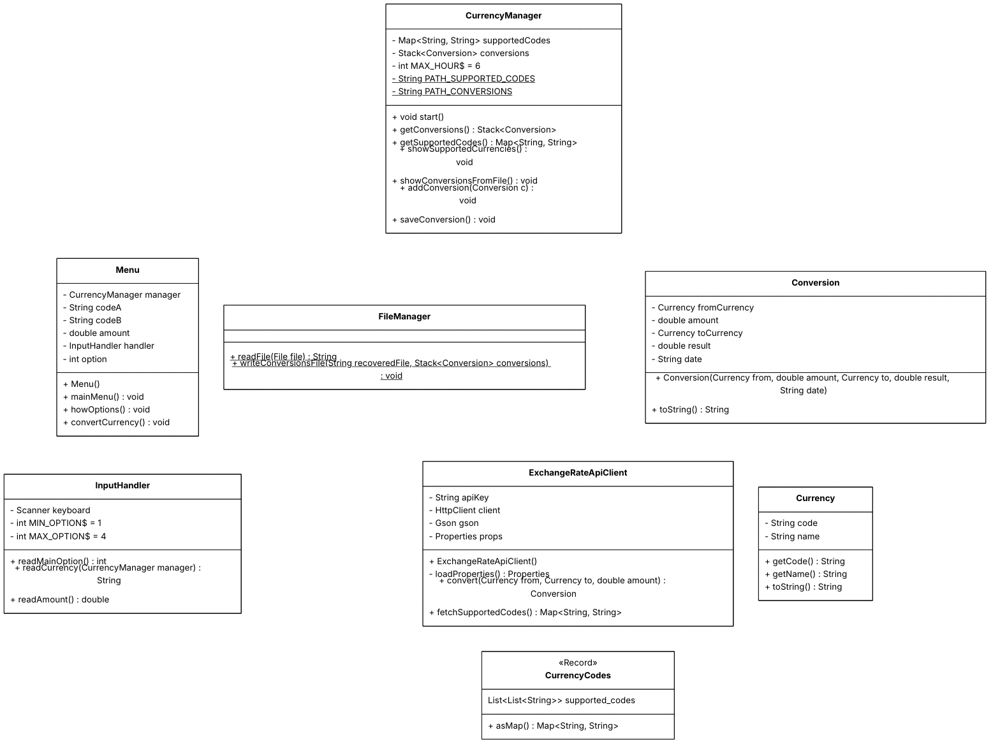

# 🪙 Currency Converter
### Challenge ONE | Oracle + Alura LATAM


>This project is a currency converter that allows you to convert between **+160 currencies** in real time using the <a href="https://www.exchangerate-api.com/">**ExchangeRate-API**</a> and also is one of the first **Alura + Oracle Next Education** challenges.

## 📝 Project Description <a name="id1"></a>

This project aims to apply key Java programming concepts, such as:
- APIs consumption,
- Parsing JSON responses with the **Gson** library,
- Handling custom exceptions,
- File management,
- User interaction through the console.

---
## 🔧 Functionalities <a name="id2"></a>
The program runs from the console and includes several features:
- ✅ An interactive and dynamic menu.
- ✅ Conversion between more than 160 currencies.
- ✅ Conversion history with timestamps.
- ✅ Validation of currencies, amounts, and allowed options.
- ✅ Automatic and persistent saving of all conversions.
- ✅ API consumption.
- ✅ Project based on the standard package structure: models, services, and utilities.
- ✅ Modular code.

---
## 🗒️ Class Diagram <a name="id3"></a>



---
## 🛠️ Technologies <a name="id4"></a>

|Technology | Use |
|----------|-----|
| **Java** | Main programming language |
| **Gson-2.13.2** | Response parsing with (`JsonParser`, `JsonObject`, etc.) |
| **ExchangeRate-API** | Real-time data source |
| **Postman** | Software for testing the API responses |

---
## ⚙️ Requisites <a name="id5"></a>

- A free API key of [ExchangeRate-API](https://www.exchangerate-api.com/)

--- 

## ❓ How to use <a name="id6"></a>

1. Clone the repository:

```bash

git clone https://github.com/Nico-Monti/currency-converter.git

```

2. Open the `config.properties` file in the project root:

```config.properties
API_KEY = YourKey
```

3. Add gson-2.13.2.jar to the project structure.
4. Compile and run in your favorite IDE.
5. Follow the instructions in the console.

---
## 🎞️ Screenshots <a name="id7"></a>

<div align="center" style="border:1px solid #ccc; padding:10px;">
  
  
  
  
  
</div>

---
## ⚖️ License <a name="id8"></a>

This project is under the MIT license. [Click here](LICENSE) for more details.
